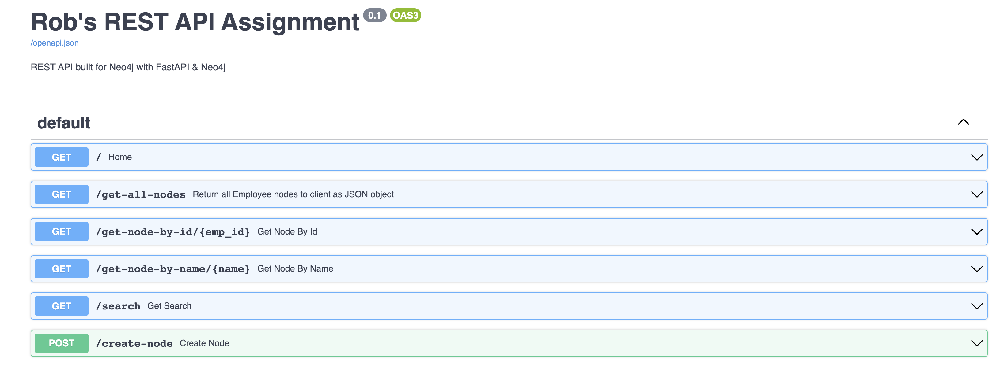
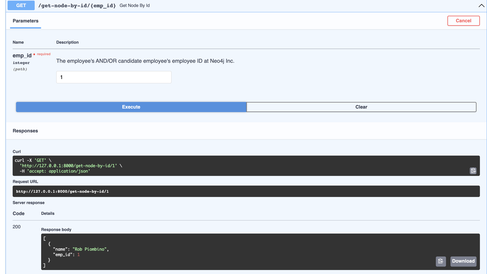

# my-neo4j-api

FastAPI - A Python-based framework to create REST APIs to interact with Neo4j.

---

## The Objective

The task is to develop a simple API that would process input data,
communicate with Neo4J and return results to the client.
API - REST or GraphQL will support 2 operations:

1. Create an Employee node
This operation will take 2 params - a String and an int.
String value will populate the name property of the new Employee node,
int value will populate emp_id value.
Don't worry about data validation etc.

2. Return all Employee nodes to the client. Any format is fine.
For the actual implementation use Java (Spring boot, Dropwizard, Spark
java etc) , Javascript (NodeJS + Express etc) or Python.

3. When done, check your code into a github repo along with instructions
on how to set up/use the API.

4. To demonstrate API usage with any HTTP or GrapQL client (see bonus
task #1 below) - please include instructions on how to use it in the
README.md file in the github repo.

5. Bonus task 1: develop a simple UI that can be used directly from the
web browser to drive the API - any stack will do,
from plain HTML forms to JQuery to Angular/React/etc.

6. Bonus task 2: deploy your app along with a Neo4J instance to an AWS
EC2 instance (or any other cloud) so that we can see it in action
without going through the setup process.

---

### Method(s) Used

**REST API via FastAPI:**

- Supports Two Operations (GET & POST):
  - GET Request - get all nodes (Employee nodes) to client
  - POST Request - create new Employee node
    - Employee Nodes having two properties:
      - name
        - str
      - emp_id
        - int

---

### Local Setup

What you'll need:

- Neo4j Database Instance
  - Sandbox, AuraDB or Desktop
- Python >=3.9
- Web Browser (i.e. Chrome)
- GitHub CLI or GitHub to access code base locally (clone or download)
- Docker

1. Create a new Neo4j Database
   - [Neo4j Sandbox](https://sandbox.neo4j.com/) or [AuraDB](https://console.neo4j.io/) will be the most convenient & quickest options.

2. Clone GitHub Repository, create a virtual environment within project directory & install dependencies from requirements.txt file.
   - `git clone git@github.com:rcolinp/my-neo4j-api.git`
   - `cd my-neo4j-api`
   - `python3 -m venv .venv`
   - `source .venv/bin/activate`
   - `pip install -r requirements.txt`

3. Edit the `config-template.py` file via inputting your Neo4j Database's uri, username & password. Then rename the file to `config.py`. (note python-dotenv can also be used by specifying variables within a `.env` file.)

    - The config.py file should look as follows:

    ```python
    uri = "neo4j://<HOST>:<PORT>[?<ROUTING_CONTEXT>]"
    username = "neo4j"
    password = <"INSERT PASSWORD">
    ```

    Example: (AuraDB)

    ```python
    uri = "neo4j+s://xxxxxxx.databases.neo4j.io:7687"
    username="neo4j"
    password="my-secret-password"
    ```

4. Launch the Application -> `uvicorn app.main:app --reload`

5. Navigate to Application at `http://127.0.0.1:8000/`

6. A huge benefit of using [FastAPI](https://github.com/tiangolo/fastapi) is the auto documenation via python type hints. This allows the API to be as high performant and on par with both NodeJS and GO.

- Additionally, Interactive API documentation are made available (out-of-the-box) provided by [Swagger UI](http://127.0.0.1:8000/docs).
  - This enables direct interaction with Neo4j and is a simple and intuitive way to interact directly from the web browser to drive the API.

- [Alternative API docs](http://127.0.0.1:8000/redoc) is also provided out-of-the-box. Redoc is an open-source tool that generates API documentation from OpenAPI specifications.

### API Request Examples

---

1. GET Request - Fetch all Employee Nodes:
`$ CURL 127.0.0.1:8000/get-all-nodes`

Response body:

```json
[
  {
    "name": "Rob",
    "emp_id": 0
  },
  {
    "name": "Rob Piombino",
    "emp_id": 1
  },
  {
    "name": "Ken Kane",
    "emp_id": 2
  }
]
```

---

2. GET Request - Fetch Employee Node based on emp_id property:
`$ CURL 127.0.0.1:8000/get-node-by-id/1`

Response body:

```json
[
  {
    "name": "Rob Piombino",
    "emp_id": 1
  }
]
```

---

3. GET Request - Fetch Employee Node based on name property:
`$ CURL 127.0.0.1:8000/get-node-by-name/Rob%2Piombino`

Response body:

```json
[
  {
    "name": "Rob",
    "emp_id": 0
  }
]
```

---

4. POST Request - Create an Employee Node in Neo4j

```shell
curl -X 'POST' \
'http://127.0.0.1:8000/create-node' \
-H 'accept: application/json' \
-H 'Content-Type: application/json' \
-d '{"name": "Shawn","emp_id": 4}'
```

Response body:

```json
[
  {
    "name": "Shawn",
    "emp_id": 4
  }
]
```

#### Swagger UI

---


--\-

#### GET Request - get node by id

---



---

#### Pull Docker Image from Docker Hub

`docker pull rcolinp/my-neo4j-api:latest`

Run the docker image with `docker run`:

`docker run -d -p 80:80 rcolinp/my-neo4j-api:latest`

Navigate to `http://0.0.0.0:8000/docs`
